# karpo-context

Multi-Agent 会话上下文管理 SDK。提供：
- **Summary + Sliding Window** 压缩策略
- **Token 预算管理** 与优先级降级
- **Redis 持久化** 支持 AWS ElastiCache

## Architecture

<p align="center">
  
</p>

## Installation

```bash
# 作为依赖引入
uv add git+ssh://git@github.com/machinepulse-ai/karpo-agent-context.git

# 或本地开发
uv pip install -e .
```

Requirements: Python >= 3.12

## Quick Start

### 使用 ContextPipeline（推荐）

```python
from redis.asyncio import Redis
from karpo_context import ContextPipeline, get_config

# 初始化
redis = Redis.from_url("redis://localhost:6379")
pipeline = ContextPipeline(
    redis_client=redis,
    agent_name="travel",  # 用于 Redis key 命名空间
    config=get_config("personalized"),  # fast / personalized / planning
)

# 1. Load - 加载或创建 session
session = await pipeline.load(thread_id=123, user_id="user-001")

# 2. Merge - 添加用户消息
session = pipeline.merge(session, user_input="帮我规划东京5日游")

# 3. Estimate - 估算 token 使用量
estimate = pipeline.estimate(session, persona="你是旅行规划师")
print(f"Token: {estimate['total_tokens']}, 降级等级: {estimate['degradation_level']}")

# 4. Compress - 压缩历史（如需要）
session = pipeline.compress(session, persona="你是旅行规划师")

# 5. Assemble - 组装 prompt
result = pipeline.assemble(
    session,
    persona="你是旅行规划师",
    instruction="帮助用户规划行程",
)
# result["system_prompt"] - 系统提示词
# result["messages"] - 消息列表

# 调用 LLM...
response = await llm.chat(system=result["system_prompt"], messages=result["messages"])

# 6. Complete - 保存 session
session = await pipeline.complete(session, assistant_response=response.content)
```

### 使用 SessionStateStore（低级 API）

```python
from redis.asyncio import Redis
from karpo_context import SessionStateStore, SessionState
from datetime import datetime, timezone

redis = Redis.from_url("redis://localhost:6379")
store = SessionStateStore(redis, agent_name="travel")

# 创建 session
now = datetime.now(timezone.utc)
session = SessionState(
    thread_id=123,
    user_id="user-001",
    created_at=now,
    updated_at=now,
)

# 添加消息
session.add_message("user", "你好")
session.add_message("assistant", "你好！有什么可以帮助你的？")

# 保存
await store.save(session)

# 加载
loaded = await store.get(123)
print(loaded.messages)  # 消息列表
print(loaded.turn_count)  # 用户消息轮次
```

## Configuration

### 预设配置

| 配置 | 总预算 | 历史预算 | 适用场景 |
|------|--------|----------|----------|
| `fast` | 4,000 | 2,000 | 快速响应，简单问答 |
| `personalized` | 8,000 | 4,000 | 标准对话，含情感上下文 |
| `planning` | 16,000 | 8,000 | 复杂规划，长对话 |

```python
from karpo_context import get_config, CONTEXT_CONFIGS

# 使用预设
config = get_config("fast")

# 或自定义
from karpo_context import ContextConfig, ContextBudget

config = ContextConfig(
    budget=ContextBudget(
        total_limit=12000,
        persona_prompt=1500,
        recent_history=6000,
    ),
    summary_trigger_threshold=25,
    enable_emotional_context=True,
)
```

### Token 预算分配（8K 示例）

| 组件 | 预算 | 优先级 | 超限策略 |
|------|------|--------|----------|
| Persona | 1,000 | P0 | 不裁剪 |
| Instruction | 500 | P1 | 不裁剪 |
| Summary | 500 | P1 | 压缩再压缩 |
| Emotional | 100 | P2 | 可丢弃 |
| History | 4,000 | P2 | 减少轮次 |
| Current Input | 500 | P0 | 截断警告 |
| Output Buffer | 1,400 | P0 | 保留 |

### 降级策略

| 等级 | Token 占比 | 策略 |
|------|-----------|------|
| 0 | < 70% | 正常，无裁剪 |
| 1 | 70-85% | 减少 history 30% |
| 2 | 85-100% | 丢弃 P2 组件 |
| 3 | > 100% | 仅保留 summary + 最近 3 轮 |

## Data Model

### SessionState

会话状态，存储单个对话的完整上下文。

```python
@dataclass
class SessionState:
    thread_id: int          # 会话唯一标识
    user_id: str            # 用户标识
    messages: list[ChatMessage]  # 消息历史
    summary: ConversationSummary | None  # 结构化摘要
    turn_count: int         # 用户消息轮次
    created_at: datetime
    updated_at: datetime
```

### ConversationSummary

结构化对话摘要，由 LLM 生成。

```python
@dataclass
class ConversationSummary:
    covers_until_turn: int      # 覆盖到第几轮
    generated_at: datetime      # 生成时间
    user_intent: str            # 用户主要意图
    key_entities: dict[str, str]  # 关键实体（目的地、日期等）
    decisions_made: list[str]   # 已确定事项
    pending_questions: list[str]  # 待确认问题
```

## Redis Storage

### Key 命名规范

```
ctx:{agent}:session:{thread_id}           # 主 Session
ctx:{agent}:tool:{thread_id}:{call_id}    # 卸载的 Tool 结果
ctx:{agent}:errors:{thread_id}            # 错题本 (List)
ctx:{agent}:summary_backup:{thread_id}    # Summary 备份 (List)
```

示例（agent=travel, thread_id=123）：
```
ctx:travel:session:123
ctx:travel:tool:123:call_001
ctx:travel:errors:123
ctx:travel:summary_backup:123
```

### Tool 结果卸载

大于 500 tokens 的 tool 结果会自动卸载：

```python
# 保存 tool 结果
await store.save_tool_result(
    thread_id=123,
    call_id="call_001",
    result={"flights": [...]}  # 大量数据
)

# 加载 tool 结果
result = await store.get_tool_result(thread_id=123, call_id="call_001")
```

### 错题本

记录 ReAct 过程中的失败：

```python
await store.append_error(
    thread_id=123,
    error={
        "step": 3,
        "tool_name": "book_flight",
        "error_type": "SOLD_OUT",
        "message": "航班已售罄",
    }
)

# 滑动窗口，最多保留 50 条
errors = await store.get_errors(thread_id=123)
```

### Summary 备份

保存摘要时的原始消息，用于回溯：

```python
await store.save_summary_backup(
    thread_id=123,
    backup={
        "summary": summary.to_dict(),
        "original_messages": [m.to_dict() for m in messages],
        "created_at": datetime.now().isoformat(),
    }
)

# 滑动窗口，最多保留 20 条
backups = await store.get_summary_backups(thread_id=123)
```

## Multi-Agent 使用

```python
from karpo_context import ContextPipeline, get_config
from redis.asyncio import Redis

redis = Redis.from_url("redis://localhost:6379")

# karpo-agent-main (标准对话)
main_pipeline = ContextPipeline(
    redis_client=redis,
    agent_name="main",
    config=get_config("personalized"),
)

# karpo-agent-persona (快速查询)
persona_pipeline = ContextPipeline(
    redis_client=redis,
    agent_name="persona",
    config=get_config("fast"),
)

# karpo-agent-plan (复杂规划)
plan_pipeline = ContextPipeline(
    redis_client=redis,
    agent_name="plan",
    config=get_config("planning"),
)
```

## Legacy API

旧版 `ContextManager` API 仍可用，但推荐使用 `ContextPipeline`：

```python
# 旧版 API（仍支持）
from karpo_context import create_context_store, ContextManager

store = create_context_store()
manager = ContextManager(store=store)
ctx = await manager.load(conversation_id=42)
```

## Development

```bash
# 安装开发依赖
uv sync --group dev

# 运行测试
uv run pytest -v

# 当前测试覆盖：162 tests
```

## API Reference

### ContextPipeline

主入口，实现 6 阶段 context 组装流程。

| 方法 | 说明 |
|------|------|
| `load(thread_id, user_id)` | 加载或创建 session |
| `merge(session, user_input)` | 添加用户消息 |
| `estimate(session, persona, ...)` | 估算 token 使用量 |
| `compress(session, persona, ...)` | 压缩历史 |
| `compress_async(session, ...)` | 异步压缩（含 summary 生成） |
| `assemble(session, persona, ...)` | 组装 prompt |
| `complete(session, response)` | 保存 session |

### TokenBudgetManager

Token 预算管理。

| 方法 | 说明 |
|------|------|
| `estimate_tokens(text)` | 估算文本 token 数 |
| `estimate_messages_tokens(messages)` | 估算消息列表 token |
| `calculate_degradation_level(total)` | 计算降级等级 (0-3) |
| `should_trigger_summary(...)` | 判断是否触发摘要 |

### SessionStateStore

Redis 存储。

| 方法 | 说明 |
|------|------|
| `get(thread_id)` | 获取 session |
| `save(session)` | 保存 session |
| `delete(thread_id)` | 删除 session |
| `save_tool_result(...)` | 保存 tool 结果 |
| `get_tool_result(...)` | 获取 tool 结果 |
| `append_error(...)` | 追加错误记录 |
| `get_errors(...)` | 获取错误列表 |
| `save_summary_backup(...)` | 保存 summary 备份 |
| `get_summary_backups(...)` | 获取备份列表 |
